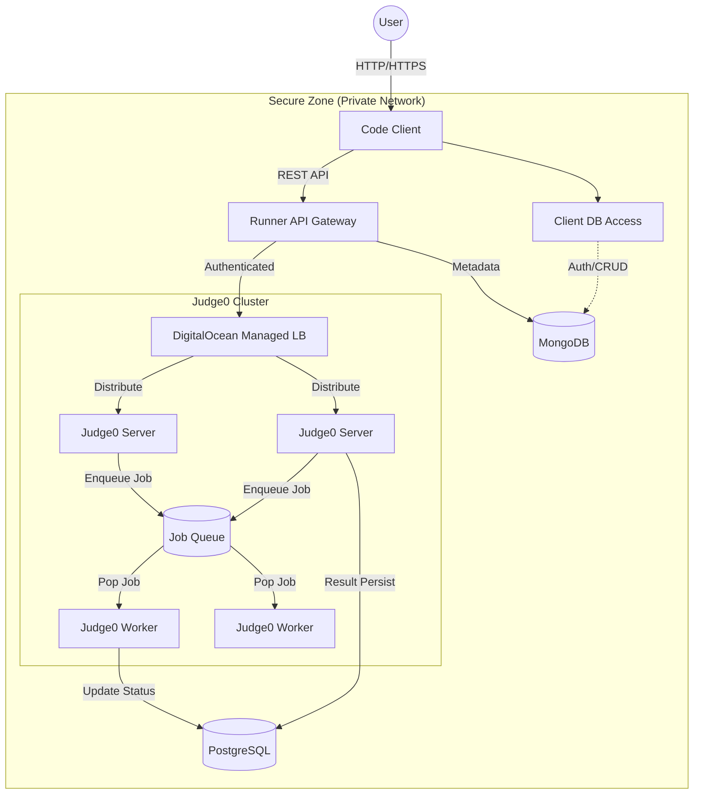

# Distributed Code Runner Simulation

A production-grade, distributed code execution platform designed to run untrusted code securely and scalably. This system implements a **Shared Nothing Architecture**, decoupling the user-facing client, the API gateway, and the sandboxed execution engine into isolated services.

## System Architecture

The system is composed of three primary logical layers: the **Presentation Layer**, the **Orchestration Layer**, and the **Execution Layer**.



### 1. Presentation Layer Used: `code-client`
*   **Tech Stack**: Next.js (React), Tailwind CSS.
*   **Responsibility**: Provides the IDE interface for users to write and submit code.
*   **Data Access**: Connects directly to **MongoDB** to handle User Authentication (signup/login) and CRUD operations for saving user code snippets.
*   **Security**: This is the *only* component accessible to the public internet. It communicates with the Runner Service for code execution and MongoDB for data persistence.

### 2. Orchestration Layer Used: `runner-api`
*   **Tech Stack**: Node.js (Express), Nginx.
*   **Responsibility**:
    *   **Gatekeeper**: Validates requests, handles authentication, and rate-limiting.
    *   **Router**: Forwards valid execution requests to the internal execution cluster.
    *   **Isolation**: It acts as a strict proxy; the execution cluster is never exposed directly to the client.

### 3. Execution Layer Used: `judge0`
The core engine is a customized Judge0 cluster, split into **Servers** and **Workers** for scalability.

*   **Judge0 Server (API Node)**
    *   Accepts execution requests from the Gateway.
    *   Validates the payload and pushes the job to the **Redis Job Queue**.
    *   Does *not* execute user code.

*   **Judge0 Worker (Execution Node)**
    *   Polls the Redis queue for pending jobs.
    *   **Sandboxing**: Executes the untrusted code inside isolated containers (creating ephemeral Docker containers for every submission).
    *   Updates the submission status in **PostgreSQL**.

---

## Data Strategy

The system uses specialized data stores for specific needs:
*   **MongoDB**: Stores user session data, submission history, and client configurations.
*   **Redis**: High-performance job queue for buffering submissions between the Server and Worker nodes.
*   **PostgreSQL**: The authoritative store for Judge0 execution results, languages, and system state.

---

## Deployment

The architecture is designed to be physically distributed. In a production environment (e.g., DigitalOcean), each component runs on its own isolated server (Droplet) within a private VPC.

For a detailed, step-by-step production deployment guide, including network security rules and strict server isolation, please refer to:

**[Production Deployment Guide (DEPLOYMENT.md)](DEPLOYMENT.md)**

---

## Local Development (Simulation)

You can simulate the entire distributed topology locally using Docker Compose. The project uses a **Makefile** to orchestrate the complex multi-service setup.

### Prerequisites
*   Docker & Docker Compose
*   Make (usually pre-installed on Linux/Mac)

### Quick Start
```bash
# 1. Create Simulation Networks
make setup

# 2. Start All Services
make start-all
```

### ⚡ Live Development (Hot Reload)
Both the **Code Client** (Next.js) and **Runner Service** (Express) are configured with Docker Volumes for hot-reloading.
*   **No Rebuilds Needed**: You can edit source files in `code-client/` or `code-runner-service/server/` locally.
*   **Instant Updates**: Changes are reflected immediately in the running containers.

### Management Commands
| Command | Description |
| :--- | :--- |
| `make help` | Show all available commands. |
| `make start-all` | Starts the entire cluster (Client, Gateway, Judge0, DBs). |
| `make stop-all` | Stops all services. |
| `make status` | Shows the status of all containers. |
| `make logs-client` | Follow logs for the Frontend. |
| `make logs-runner` | Follow logs for the API Gateway. |